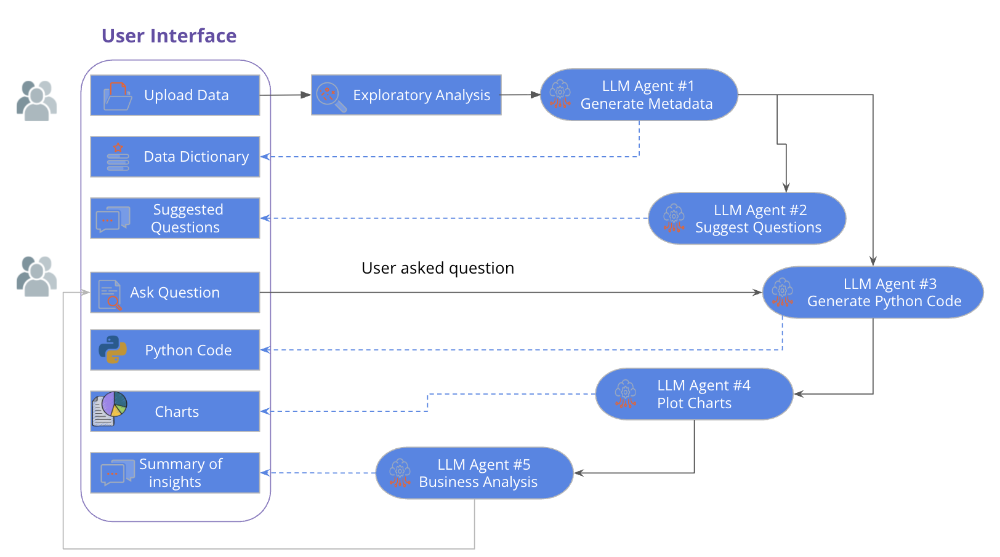

# InstaData – AI Data Analyst App

InstaData is a Streamlit-based web application that allows users to upload datasets and interact with them using an AI-powered chatbot. The app helps users explore data, ask questions about their datasets, and generate insights through natural language queries.

## Features

- Upload CSV datasets for analysis
- AI-powered chatbot for data exploration
- Interactive data analysis through natural language
- Secure authentication using Firebase
- Streamlit-based web interface
- Example datasets included for testing

---

## Project Pipeline

---

## Project Structure

```
InstaData/
│
├── .streamlit/           # Streamlit configuration (not included in repo)
│   ├── config.toml
│   └── secrets.toml
│
├── app/                  # Main application code
│   ├── main.py
│   ├── chatbot.py
│   └── account.py
│
├── assets/               # Logos and UI images
│
├── sample_data/          # Example CSV datasets
│
├── requirements.txt      # Python dependencies
├── start-app.sh          # Script to start the application
└── README.md
```

---

## Requirements

- Python 3.9+
- Streamlit
- Firebase account
- AI API key (OpenAI or other provider)

Install dependencies:

```bash
pip install -r requirements.txt
```

---

## Configuration (Secrets Setup)

Sensitive credentials are **not included in this repository**.  
You must create a local secrets file before running the application.

Create the following file:

```
.streamlit/secrets.toml
```

Example structure:

```toml
# AI provider API key
OPENAI_API_KEY="your_api_key_here"

# Firebase configuration
FIREBASE_API_KEY="your_firebase_api_key"
FIREBASE_PROJECT_ID="your_project_id"
FIREBASE_AUTH_DOMAIN="your_project.firebaseapp.com"
FIREBASE_STORAGE_BUCKET="your_project.appspot.com"
```

Your credentials can be obtained from:

- Firebase Console
- Your AI API provider

The app accesses these values using:

```python
st.secrets["OPENAI_API_KEY"]
```

---

## Running the Application

Run the Streamlit app locally:

```bash
streamlit run app/main.py
```

Or use the included script:

```bash
bash start-app.sh
```

Then open the app in your browser:

```
http://localhost:8501
```

---

## Example Workflow

1. Start the application
2. Log in or authenticate through Firebase
3. Upload a CSV dataset
4. Ask questions about your data using natural language
5. Receive AI-generated analysis and insights

Example prompts:

- "What are the main trends in this dataset?"
- "Which category has the highest average value?"
- "Generate a summary of the data."

---

## Security

API keys and Firebase credentials are stored locally in:

```
.streamlit/secrets.toml
```

This file is excluded from the repository using `.gitignore` to prevent accidental exposure of sensitive information.

---

## Future Improvements

- More advanced data visualization
- Support for additional dataset formats
- Improved conversational analysis
- Deployment to Streamlit Cloud or cloud platforms

---

## License

MIT License
